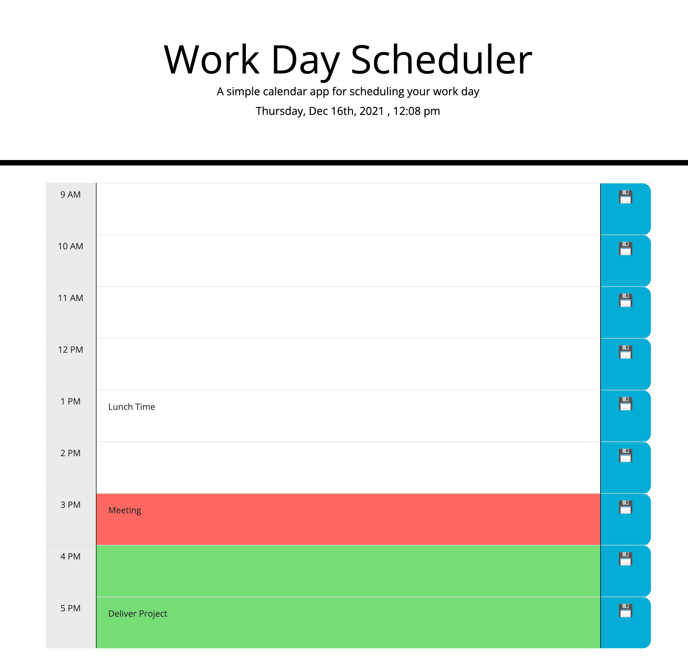

# Day Scheduler

## Description

This is a simple application that allows the user to plan their work day. The user can input their activities by each hour from 9 to 5 and then click save and have them stored in local storage so they can be retrieved even if they close the page and open it again. 

The planner has a design that allows the user to see at first glance if an activity has passed, is active or is coming by showing hours in a past, present and future color coding.

## Website Appearance 

## [Published Site](https://dinoabrego.github.io/day-scheduler)